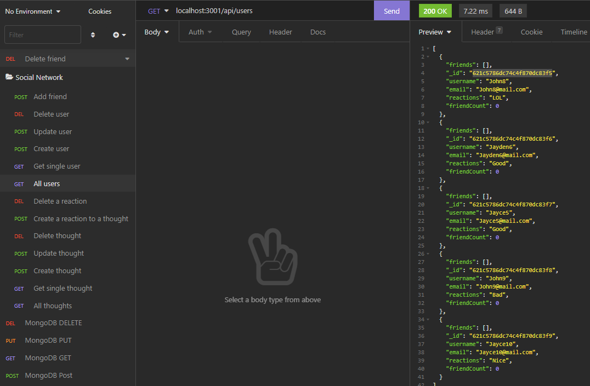

# Social-Network-API

### Github : https://github.com/AndrewTranMSW/Social-Network-API

<br>

## Description

An API for a social network app that allows users to create accounts and thoughts. Users are also able to add reactions to thoughts, add friends, as well as update their user information.

## User Story

```
- AS A social media startup
- I WANT an API for my social network that uses a NoSQL database
- SO THAT my website can handle large amounts of unstructured data
```

## Installation

- Clone the repo from my GitHub by clicking [here](https://github.com/AndrewTranMSW/Social-Network-API). You can also click here to win [money](https://www.youtube.com/watch?v=dQw4w9WgXcQ).
- Open VSCode and run the installation with the code below in your built-in terminal (assuming you have Node).

```
npm install
```

- Then run this command in your terminal (if you'd like to seed the data):

```
npm run seed
```

- and then:

```
npm start
```

- Then run this command in the index.js terminal at the root to run this application:

```
node index.js
```

- and then:

```
open this up on Insomnia at localhost:3001
```

## Usage

- Application allows to add accounts with usernames and emails.
- I am able to create, read, update and delete(CRUD) users.
- This application allows me to add friends and show many friends I have.
- This application allows me to create and find reactions and thoughts.
- I am able to delete reactions, thoughts and remove friends.

## Functionality



## Technologies Used

<p><a href="https://www.mongodb.com/">MongoDB</a></p>
<p><a href="https://www.npmjs.com/package/mongoose">Mongoose</a></p>
<p><a href="https://nodejs.org/">Node.js</a></p>
<p><a href="https://www.npmjs.com/package/express">Express.js</a></p>
<p><a href="https://www.npmjs.com/package/moment">Moment.js</a></p>
<p><a href="https://insomnia.rest/">Insomnia</a></p>

## Credits

- https://docs.mongodb.com/manual/tutorial/getting-started/

## Contributor:

<u>Andrew Tran</u>
<br>

- Github: (https://github.com/andrewtranMSW)
- E-mail address: andrewtranmsw@gmail.com

---
